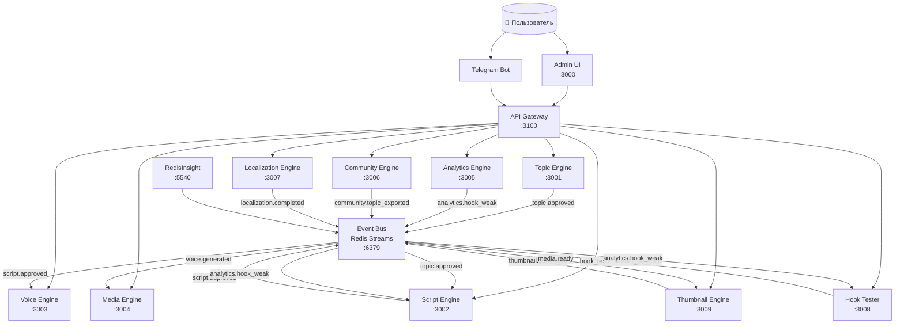

# 🏗️ Архитектура AI YouTube Pipeline

## Общая схема



## Поток данных (Happy Path)

```
1. Пользователь выбирает нишу в Admin UI
2. Topic Engine генерирует 10 тем с GPT-4o
3. Пользователь одобряет тему (Admin UI или Telegram Bot)
4. Event Bus → topic.approved → Script Engine автозапускается
5. Script Engine генерирует 3 варианта хука (Fear/Curiosity/Surprise)
6. Hook Tester получает их для A/B теста
7. Пользователь одобряет скрипт
8. Event Bus → script.approved → Voice Engine + Thumbnail Engine
9. Voice Engine генерирует аудио через ElevenLabs
10. Thumbnail Engine генерирует обложку (HuggingFace/FAL/Cloudflare)
11. Media Engine сборка: видео + аудио + обложка
12. Analytics Engine отслеживает retention_8s
13. Если retention < 40% → analytics.hook_weak → Script Engine на доработку
```

## Карта портов

| Сервис | Порт | БД |
|---|---|---|
| Admin UI (Next.js) | 3000 | — |
| Topic Engine | 3001 | 5432 |
| Script Engine | 3002 | 5433 |
| Voice Engine | 3003 | 5434 |
| Media Engine | 3004 | 5435 |
| Analytics Engine | 3005 | 5436 |
| Community Engine | 3006 | 5437 |
| Localization Engine | 3007 | 5438 |
| Hook Tester | 3008 | — |
| Thumbnail Engine | 3009 | 5439 |
| API Gateway | 3100 | — |
| Redis (Event Bus) | 6379 | — |
| RedisInsight | 5540 | — |
| Telegram Bot | — | — |

## Технологический стек

| Слой | Технология |
|---|---|
| Backend | Node.js 20 + Fastify 4 + TypeScript |
| Frontend | Next.js 14 + Tailwind CSS |
| БД | PostgreSQL 16 (отдельная на модуль) |
| ORM | Prisma 5 |
| Event Bus | Redis 7 Streams |
| AI: Текст | OpenAI GPT-4o / GPT-4o-mini |
| AI: Голос | ElevenLabs TTS |
| AI: Картинки | HuggingFace / FAL.AI / Cloudflare Workers AI |
| Telegram | grammY |
| Контейнеры | Docker Compose |
